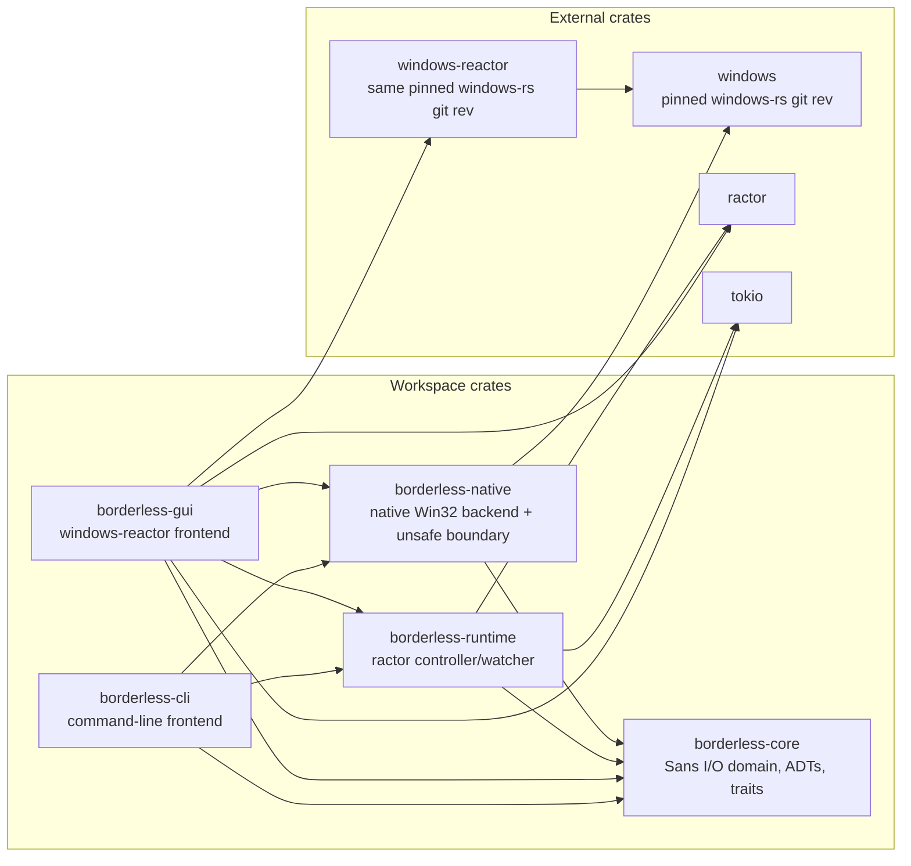
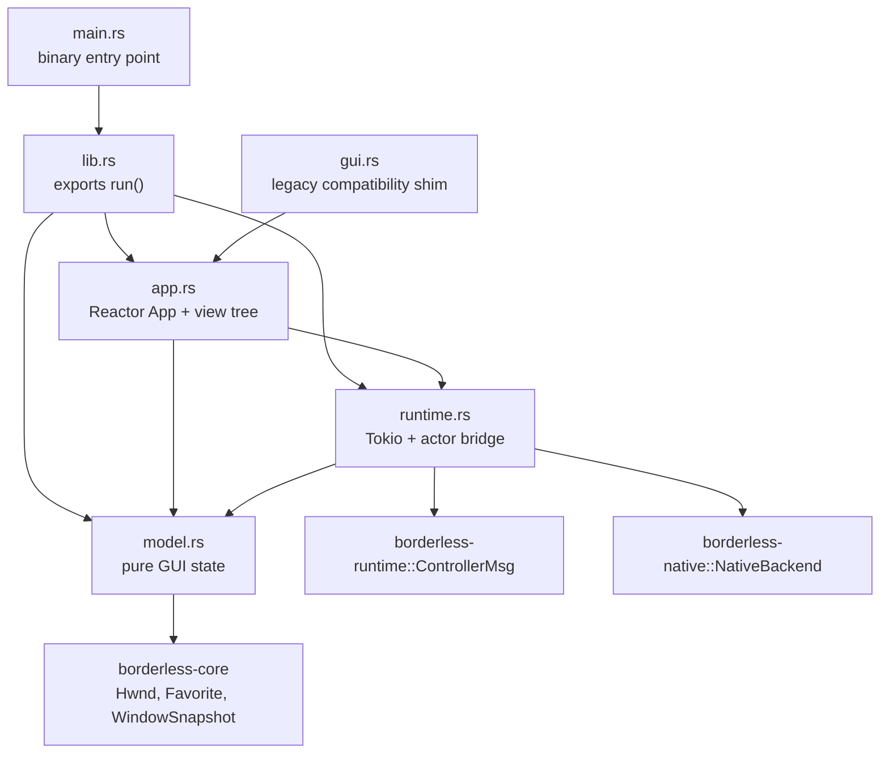
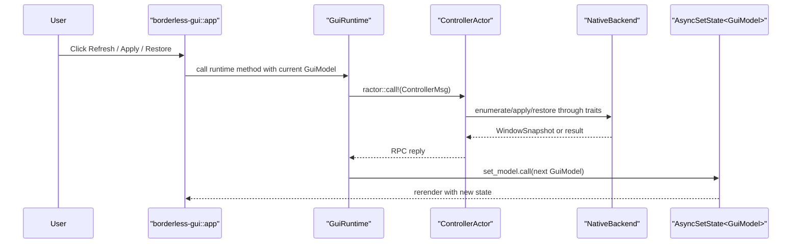

# windows-reactor GUI implementation notes

This implementation migrates `borderless-gui` from a raw Win32 proof-of-concept to a WinUI-backed `windows-reactor` application.

## Design goals

- Keep OS mutation behind `borderless-native` and actor messages.
- Keep GUI state as pure Rust data in `model.rs`.
- Use Reactor hooks and `AsyncSetState` for UI state updates from actor tasks.
- Use Windows 11 controls rather than manually painted Win32 controls.
- Prefer value-returning model updates over shared mutable UI state.

## Files

```text
crates/borderless-gui/src/
  lib.rs      # public library entry point
  main.rs     # binary entry point
  app.rs      # Reactor view tree
  model.rs    # pure GUI model/newtypes
  runtime.rs  # actor/runtime bridge
  gui.rs      # compatibility shim
```

## Reactor API surface used

The GUI intentionally uses a small, documented-looking subset of Reactor:

- `App::new().title(...).inner_size(...).backdrop(...).render(...)`
- `RenderCx::use_async_state`
- `NavigationView`, `NavViewItem`, `TitleBar`, `CommandBar`, `InfoBar`
- `Grid`, `StackPanel`, `Border`, `TextBlock`, `Button`, `ToggleSwitch`, `ScrollViewer`
- `Backdrop::Mica`, `RequestedTheme::Default`

## Runtime boundary

`GuiRuntime` owns a Tokio runtime and the `borderless-runtime` controller actor reference. UI callbacks do not call `borderless-native` directly; they spawn actor calls and marshal the next `GuiModel` back through Reactor's `AsyncSetState`.

The first `GuiModel` is also created through the controller actor. Startup performs one `ListWindows` RPC before rendering so the Windows page is populated immediately instead of starting from an empty list that requires a manual refresh.

## Windows App Runtime packaging

Reactor's framework-dependent examples call `windows_reactor::bootstrap::initialize()?` before `App::new().render(...)`. That mode requires a registered Windows App Runtime MSIX package on the machine and otherwise shows an install prompt.

`borderless-gui` instead uses `windows_reactor_setup::as_self_contained()` in `build.rs`. That copies the Windows App SDK runtime files into the target directory and embeds the manifest, so local `cargo run -p borderless-gui --target x86_64-pc-windows-msvc` does not depend on the user accepting a Windows App Runtime install prompt.

Observed failure modes during debugging:

- no Reactor bootstrap in framework-dependent mode: `Application::Start` failed with `HRESULT(0x80040154)` / `Class not registered`;
- bootstrap DLL copied but Windows App Runtime MSIX missing: startup showed "Required components of the Windows App Runtime are missing".

## Dependency structure

The GUI is now a WinUI-backed Reactor frontend, but the mutation boundary is still the same as the CLI: commands flow through `borderless-runtime` and then into the native backend.



Important dependency choices:

- `windows` and `windows-reactor` are both sourced from `microsoft/windows-rs` at rev `db87ba9940e49e84fbacb1fe494ec81a2a7690db`.
- `rust-toolchain.toml` stays on stable; only cargo scripts use `cargo +nightly -Zscript`.
- `borderless-gui` has `#![forbid(unsafe_code)]`; low-level Windows calls remain in `borderless-native` or Reactor internals.

## GUI module structure



Module responsibilities:

- `app.rs`: builds the Reactor UI shell: `NavigationView`, `TitleBar`, `CommandBar`, cards, detail panel, settings, logs, and status `InfoBar`.
- `model.rs`: stores page selection, search query, window rows, selected HWND, busy flag, watcher UI state, and local log lines.
- `runtime.rs`: boots `spawn_runtime(NativeBackend::new())`, owns the Tokio runtime, and turns UI actions into actor calls.
- `gui.rs`: keeps the old `gui::run` path as a shim, but the real entry point is `app::run`.

## Title bar behavior

Reactor wires WinUI drag behavior by finding a `TitleBar` in the rendered root tree and calling `Window::SetTitleBar(...)`. If the `TitleBar` is only rendered inside a page body, the visual title bar may appear but the top area is not registered as a draggable non-client region.

The GUI root therefore follows the upstream Reactor gallery shape: a two-row grid with `TitleBar` in row 0 and `NavigationView` in row 1. Page content should not create its own top-level `TitleBar`.

## Locale direction

User-facing GUI labels live in `locale.rs` instead of being scattered through `app.rs`. The current detector checks `BORDERLESS_LOCALE` first, then `LANG`; values beginning with `ja` select Japanese strings and everything else falls back to English.

PowerShell example:

```powershell
$env:BORDERLESS_LOCALE = "ja"
cargo run -p borderless-gui --target x86_64-pc-windows-msvc
```

Runtime status messages are still mostly English because they are produced by actor/controller code. The next localization pass should move those status constructors behind the same text table or emit structured status IDs from the runtime bridge.

## Aspect-fit apply

The Windows page exposes aspect-fit controls instead of a single hard-coded 4:3 button. The GUI model stores:

- a ratio preset (`4:3`, `16:9`, `16:10`, current window, or custom);
- custom width/height values;
- a target display choice (`Current`, `Primary`, or a monitor from `ListMonitors`).

Applying aspect fit sends an explicit `FavoriteOptions` override through `ControllerMsg::ApplyByHwndWithOptions` with `FavoriteSize::AspectFit { width, height }`. The core session planner resolves the selected target frame, then computes the largest centered rectangle with that ratio. On a 1920x1080 monitor, 4:3 becomes 1440x1080 at x=240, y=0. `should_maximize` is forced off for this mode so Windows does not stretch the game back to the full 16:9 monitor.

HWND-targeted apply bypasses the normal targetable-window filter. This is important because a first borderless apply removes window styles, so a second aspect-fit apply must still be able to find the same HWND.

Dedicated black-band overlay windows are not implemented yet; currently the unused monitor area remains whatever is behind the centered game unless the taskbar/background is hidden separately.

## DPI and input scaling

`windows-reactor` requests `DPI_AWARENESS_CONTEXT_PER_MONITOR_AWARE_V2` when the GUI app starts rendering. `borderless-cli` requests the same awareness at process startup before using the native Win32 backend. This keeps `GetWindowRect`, monitor rectangles, and `SetWindowPos` in the same physical coordinate space as the target game window. Without this, Windows DPI virtualization can make the aspect-fit rectangle look visually plausible while mouse input lands at scaled or offset coordinates inside the game.

## Environment reset

`GuiRuntime` keeps a reset-on-exit flag, exposed in Settings. When enabled, the final runtime drop asks the controller to show the taskbar and cursor again. Apply-time taskbar hiding uses the planned placement rectangle and hides only taskbar windows whose rectangles intersect that target area; manual Settings buttons still use the broad show/hide command.

## Applied state journal

The runtime persists captured `OriginalWindowState` records to `applied-windows.toml` through `AppliedStateStore`. This lets a later GUI/CLI process restore a window that was left borderless after Borderless Oxide exited. Re-applying or aspect-fitting an already-managed HWND keeps the first captured original state instead of overwriting it with the borderless state.

The Windows list keeps visible borderless-like windows targetable so a managed window can still be selected and restored after the app restarts. The UI marks these rows as `Borderless` / `枠なし`. This is a style-based state check, not proof that Borderless Oxide originally modified the window; the journal is the authoritative source for restore data.

## UI action flow



This keeps the UI reactive without giving the view layer direct access to Win32 mutation APIs.

## Known gaps for the next pass

This pass provides a real Reactor shell and core window/favorite/settings actions, but it intentionally leaves these larger parity items as next steps:

- full favorite editor for all `FavoriteOptions` fields;
- watcher pause/resume actor messages;
- global hotkeys;
- tray icon integration;
- startup task integration;
- foreground tracking and CoreAudio mute-on-background;
- desktop area selector overlay.

The current structure is designed so those additions land in `borderless-core`, `borderless-native`, and `borderless-runtime`, while `borderless-gui` stays mostly view/model glue.
