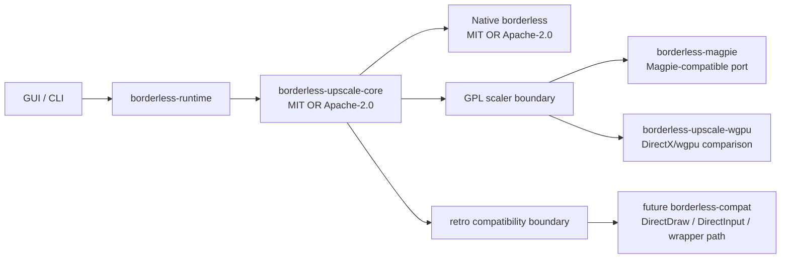
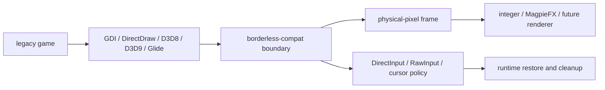
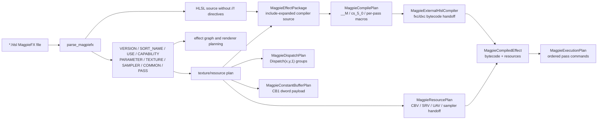

<!-- SPDX-License-Identifier: MIT OR Apache-2.0 -->

# Upscale Integration Plan

The integrated scaler work is split into three lanes:



## Lanes

| Lane | Current crate | License | Purpose |
| --- | --- | --- | --- |
| Magpie style | `borderless-magpie` | GPL-3.0-or-later | Capture -> shader/effect graph -> fullscreen host. |
| IntegerScaler style | `borderless-upscale-core` | MIT OR Apache-2.0 | Source client size, integer scale, crop, and cursor clipping policy. |
| Retro compatibility | future `borderless-compat` | GPL or separate wrapper license | Legacy API wrapper, DirectInput remap, DirectDraw/GDI/Glide compatibility. |

## Current ADT boundary

`borderless-upscale-core` owns the clean Rust model:

```rust
enum CompatibilityMode {
    NativeBorderless,
    ProxyPresentation,
    LegacyWrapper,
    HookedPresentation,
}

enum CaptureBackend {
    GraphicsCapture,
    DesktopDuplication,
    DwmSharedSurface,
    Gdi,
}

enum ScalingBackend {
    Integer,
    Lanczos,
    Fsr1,
    Anime4k,
    MagpieFxCompatible,
    DirectMl,
}

enum InputBackend {
    NoRemap,
    ClipCursor,
    WindowMessageRemap,
    DirectInputShim,
    RawInputShim,
}

enum LegacyPresentationApi {
    None,
    Gdi,
    DirectDraw,
    Direct3d8,
    Direct3d9,
    Glide,
}

enum LegacyPresentationStrategy {
    None,
    BorderlessWindow,
    ProxyPresentation,
    WrappedPresentation,
}
```

The default build can use these types without linking GPL scaler crates. Enabling `magpie-port`
pulls in `borderless-magpie`; enabling `magpie-wgpu-compare` additionally pulls in the DirectX/wgpu
comparison crate.

## Retro compatibility layer

The retro-game path is intentionally separate from the Magpie upscale path. Magpie-compatible code
answers "how do we scale and present the final image"; the compatibility layer answers "how do we
make an old presentation or input model produce a reliable image and usable input first".



The clean-room configuration lives in `borderless-upscale-core` as `LegacyCompatibilityProfile`
and `RetroCompatibilityPlan`. That keeps profiles, GUI settings, and CLI flags permissively
licensed while leaving any wrapper or ported compatibility implementation in a dedicated crate.
`LegacyCompatibilityProfile::recommended_for_api` maps GDI, DirectDraw, D3D8, D3D9, and Glide into
an initial strategy, and `RetroCompatibilityPlan` turns that into the physical-pixel pipeline plus
explicit requirements such as API wrapping, proxy presentation, input remapping, palette sync,
software cursor handling, and runtime restoration.

The planned implementation order is:

1. `BorderlessWindow`: use the existing native path for games that only need style/position fixes.
2. `ProxyPresentation`: capture the legacy client output and present it through the scaler host.
3. `WrappedPresentation`: interpose old APIs such as DirectDraw or DirectInput only when proxy
   capture cannot preserve timing, palette, cursor, or exclusive-mode assumptions.

This layer should prefer physical pixels at the Win32 boundary, preserve aspect ratio by default for
4:3/5:4 games, and keep taskbar/cursor restoration in the runtime cleanup path.

## Current implementation status

`borderless-magpie` now owns the GPL-only Magpie-compatible path. The first concrete slice is a
MagpieFX directive parser that keeps effect metadata separate from the shader body:

The parser, effect-asset compatibility checks, and render-resource planning in `borderless-magpie`
directly follow Magpie behavior and therefore remain GPL-3.0-or-later with Magpie attribution.



The parser currently recognizes these directive groups:

- global: `MAGPIE EFFECT`, `VERSION`, `SORT_NAME`, `USE`, `CAPABILITY`, `COMMON`;
- resources: `PARAMETER`, `LABEL`, `DEFAULT`, `MIN`, `MAX`, `STEP`, `TEXTURE`, `WIDTH`,
  `HEIGHT`, `FORMAT`, `SOURCE`, `SAMPLER`, `FILTER`;
- passes: `PASS`, `DESC`, `STYLE`, `IN`, `OUT`, `BLOCK_SIZE`, `NUM_THREADS`.

Validation requires `VERSION`, at least one texture, at least one pass, and explicit `INPUT` and
`OUTPUT` texture declarations. The native DirectX renderer, capture path, and shader compilation
are still separate follow-up slices.

The parser output can now be converted into `EffectGraph`, preserving pass style, inputs, outputs,
LUT/source texture references, compute block sizes, thread counts, and pass descriptions. That graph
is the handoff point for both the native DirectX renderer path and the later wgpu comparison path.

`MagpieRenderPlan` resolves MagpieFX textures into renderer-facing resources:

- `INPUT` and `OUTPUT` use the capture/output frame sizes;
- intermediate textures resolve simple Magpie dimension expressions such as `INPUT_WIDTH * 2`;
- `SOURCE` textures can be resolved from the effect file directory with `from_effect_file`;
- DDS source assets are read through a Pure Rust header parser for width, height, and DXGI format;
- pass inputs and outputs are validated against declared texture names and Magpie pass IO rules.

The pass IO validation follows Magpie constraints: `OUTPUT` cannot be read, intermediate passes
cannot write `INPUT`, `OUTPUT`, or `SOURCE` textures, each pass output list is capped at 8 textures,
the same pass cannot read and write the same texture, and the final pass must output exactly
`OUTPUT`.

The ignored `parse_magpie_assets` integration test can be pointed at a Magpie `src/Effects`
checkout with `MAGPIE_EFFECTS_DIR`; it parses, expands HLSL includes, resolves DDS source metadata,
and render-plans the effect assets as a compatibility gate.

`MagpieEffectPackage` is the current compiler handoff object. It contains the parsed `MagpieFx`, the
`MagpieRenderPlan`, the include-expanded HLSL compiler source, the resolved include list, and the
resolved `SOURCE` asset list.

The parser now keeps compiler-relevant HLSL separated into prelude, `COMMON`, and per-`PASS` source
blocks. `MagpieEffectPackage::compiler_source_for_pass` uses those blocks instead of the full effect
file, so resource declaration/cbuffer generation can mirror Magpie's pass-source generation without
duplicating parsed `TEXTURE` or `SAMPLER` declarations.

`MagpieCompilePlan` derives per-pass shader jobs from a package. It follows Magpie's compute-shader
compile convention: every pass compiles through the `__M` entry point with `cs_5_0`, including
PS-style passes, and carries Magpie macros such as `MP_BLOCK_WIDTH`, `MP_NUM_THREADS_X`, `MP_PS_STYLE`,
`MP_FP16`, and the `MF*` float/min16float aliases.

Each shader job now also carries the Magpie-style binding plan and generated HLSL source:

- `cbuffer __CB1 : register(b0)` for input/output size, texel size, scale, and PS-style intermediate
  output sizes plus `float`/`int` Magpie parameters;
- optional `cbuffer __CB2 : register(b1)` with `__frameCount` for `_DYNAMIC` effects;
- pass-local `Texture2D<T> : register(tN)` and `RWTexture2D<T> : register(uN)` declarations using
  Magpie's format-to-texel-type table;
- effect samplers as `SamplerState : register(sN)`;
- built-in helpers such as `Rmp8x8`, `GetInputSize`, `GetOutputPt`, and `GetScale`;
- `USE MulAdd` helper overloads using `mad`;
- Magpie-style PS pass wrapping with bounds checks and the four 8x8 sub-tile writes.

`MagpieCompileOptions` can now switch parameters from cbuffer fields to Magpie-style inline
`static const` values. Overrides are validated against the parsed parameter list, default values are
used when no override is supplied, and jobs carry the `MP_INLINE_PARAMS` macro when this mode is
enabled.

`MagpieExternalHlslCompiler` is the current Pure Rust handoff to actual shader bytecode. It writes a
per-pass generated HLSL source file to a temporary path, invokes `fxc` or `dxc`, reads the resulting
`.cso`, captures diagnostics, and removes the temporary files on drop. The Magpie-compatible default
target remains `cs_5_0`, so `fxc` is the expected compiler for parity with Magpie's Direct3D 11 path.

`MagpieCompiledEffect` validates and bundles compiled per-pass bytecode with `MagpieResourcePlan`.
The actual compiler execution path still uses `MagpieExternalHlslCompiler`, but the bundle can also
be assembled from precompiled bytecode for tests, caches, and future renderer handoff code.

`MagpieExecutionPlan` lowers a compiled effect into ordered pass commands: begin pass, bind compute
pipeline, bind CB1/optional CB2, bind SRVs, bind UAVs, bind samplers, dispatch, and end pass. It is
still API-neutral, so the native DirectX path and the wgpu comparison path can interpret the same
command contract.

`MagpieDispatchPlan` mirrors Magpie's `EffectDrawer::_UpdatePassResources` dispatch math. Each pass
uses the first output texture size and the normalized block size, then computes
`Dispatch(ceil(width / block_width), ceil(height / block_height), 1)`. PS-style passes normalize to
Magpie's 16x16 block.

`MagpieConstantBufferPlan` mirrors Magpie's `EffectDrawer::_UpdateConstants` CB1 layout. It packs
input/output sizes, texel sizes, scale, non-final PS-style pass output size/texel constants, and
non-inline parameter values into padded 32-bit dwords. `MagpieDynamicConstantBuffer` represents the
optional `_DYNAMIC` frame-count CB2 payload.

`MagpieResourcePlan` is the renderer handoff shape for the next DirectX/wgpu slice. It combines the
per-pass compile jobs, dispatch groups, CB1/optional CB2 bindings, SRV/UAV texture bindings, and
sampler bindings without depending on a concrete D3D or wgpu API. That gives both renderer paths the
same Magpie-compatible resource order to execute.

The remaining DirectX work is to add any remaining optional helper paths and wire the compiled
bytecode into the actual D3D renderer/backend.

## Renderer comparison rule

The Magpie-compatible native DirectX path is the reference. The wgpu path is eligible to replace it
only if benchmark summaries show comparable frame time and frame pacing under the same capture,
effect graph, and output rectangle.

The benchmark scaffold stores per-frame samples as:

```rust
struct BenchmarkSample {
    backend: RendererBackend,
    frame_index: u64,
    elapsed_nanos: u128,
}
```

Adoption criterion for the wgpu path:

- average frame time within 5% of the native DirectX path;
- p95 frame time within 10% of the native DirectX path;
- no additional frame drops in a fixed-duration capture replay.

## Implementation order

1. Keep `borderless-upscale-core` permissive and clean-room.
2. Port Magpie-compatible effect graph and renderer state into GPL crates.
3. Add capture backends one at a time: Graphics Capture first, then Desktop Duplication.
4. Add shader assets with per-file SPDX and source attribution.
5. Add wgpu/DirectX comparison path behind `magpie-wgpu-compare`.
6. Adopt wgpu only after benchmark parity is demonstrated.
