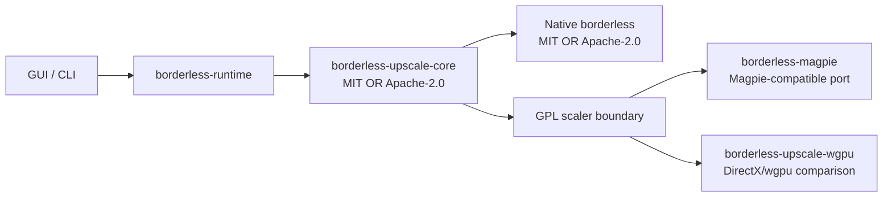

<!-- SPDX-License-Identifier: MIT OR Apache-2.0 -->

# Upscale Integration Plan

The integrated scaler work is split into three lanes:



## Lanes

| Lane | Current crate | License | Purpose |
| --- | --- | --- | --- |
| Magpie style | `borderless-magpie` | GPL-3.0-or-later | Capture -> shader/effect graph -> fullscreen host. |
| IntegerScaler style | `borderless-upscale-core` | MIT OR Apache-2.0 | Source client size, integer scale, crop, and cursor clipping policy. |
| DxWnd/dxwrapper style | future crate | GPL or separate wrapper license | Legacy API wrapper, DirectInput remap, DirectDraw compatibility. |

## Current ADT boundary

`borderless-upscale-core` owns the clean Rust model:

```rust
enum CompatibilityMode {
    NativeBorderless,
    ProxyPresentation,
    LegacyWrapper,
    HookedPresentation,
}

enum CaptureBackend {
    GraphicsCapture,
    DesktopDuplication,
    DwmSharedSurface,
    Gdi,
}

enum ScalingBackend {
    Integer,
    Lanczos,
    Fsr1,
    Anime4k,
    MagpieFxCompatible,
    DirectMl,
}

enum InputBackend {
    NoRemap,
    ClipCursor,
    WindowMessageRemap,
    DirectInputShim,
    RawInputShim,
}
```

The default build can use these types without linking GPL scaler crates. Enabling `magpie-port`
pulls in `borderless-magpie`; enabling `magpie-wgpu-compare` additionally pulls in the DirectX/wgpu
comparison crate.

## Renderer comparison rule

The Magpie-compatible native DirectX path is the reference. The wgpu path is eligible to replace it
only if benchmark summaries show comparable frame time and frame pacing under the same capture,
effect graph, and output rectangle.

The benchmark scaffold stores per-frame samples as:

```rust
struct BenchmarkSample {
    backend: RendererBackend,
    frame_index: u64,
    elapsed_nanos: u128,
}
```

Adoption criterion for the wgpu path:

- average frame time within 5% of the native DirectX path;
- p95 frame time within 10% of the native DirectX path;
- no additional frame drops in a fixed-duration capture replay.

## Implementation order

1. Keep `borderless-upscale-core` permissive and clean-room.
2. Port Magpie-compatible effect graph and renderer state into GPL crates.
3. Add capture backends one at a time: Graphics Capture first, then Desktop Duplication.
4. Add shader assets with per-file SPDX and source attribution.
5. Add wgpu/DirectX comparison path behind `magpie-wgpu-compare`.
6. Adopt wgpu only after benchmark parity is demonstrated.

